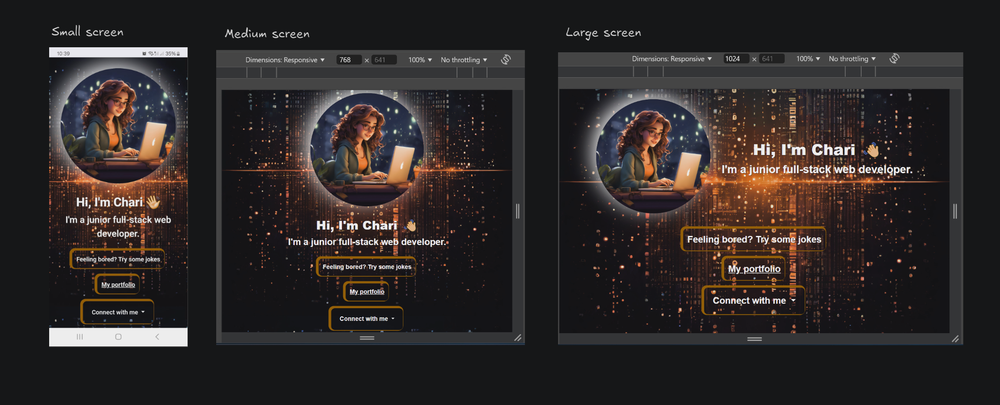

# jQuery and Bootstrap

## Table of Content

- [Description](#Description)
- [Visuals](#Visuals)
- [Build_with](#Build_with)
- [Deployed_Website_URL](#Deployed_Website_URL)
- [Resources_links](#Resources_links)
- [Feedback](#Feedback)
- [License](#License)

---
## Description

**Find the challenge instructions in [CHALLENGE.md](./CHALLENGE.md) file or click [HERE](./CHALLENGE.md).**

---
## Visuals

**Views in different screen size.**

---

## Build_with

  
  
  

---

## Deployed_Website_URL

- [sbc week3- jQuery and Bootstrap challenge](https://sbc-week3-bootstrap-jquery.vercel.app/)

---

## Resources_links

- [jQuery UI Documentation](https://jqueryui.com/)
- [Bootstrap Documentation](https://getbootstrap.com/docs/5.0/getting-started/introduction/)

---

## Feedback

Click this [form](https://feedback-form-mcc.netlify.app/) for feedback and questions.

---

## License

 .
